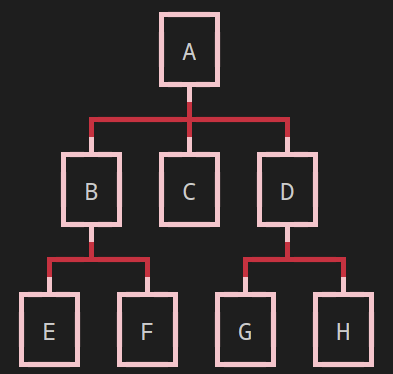

# trim
Draws trees with text art 


## Build

A compiler that supports c++20 is needed.

```
mkdir build
cd build
cmake ..
make
```

## Example

```
./trim "(A(B(E)(F))(C)(D(G)(H)))" --style=thick --box-color=#F7C5CC --branch-color=#CC313D
```



## Parameters

`--help for more information`

## Input formats

The tree to draw can be provided in multiple formats

### Parenthesized string

The input must contain a balanced sequence of parentheses.
All parentheses must be nested in a outermost pair of parentheses.
The following is not allowed: `(()()) ()`.

Following an open parenthesis, any text can be provided, it will be printed as label.
If no text is provided, a unique numerical label is generated.

Example:

```
(A(B)(C))
```

Output:

```
   ┌───┐    
   | A |    
   └─┬─┘    
  ┌──┴───┐  
┌─┴─┐  ┌─┴─┐
| B |  | C |
└───┘  └───┘
```

## Bitstring

The input must contain a sequence of `1` and `0`.
This format can only be used to draw binary trees.
The character `1` denotes an existing node, the character `0` denotes a missing node.
If the character at index `n` is `1`, the character at `n*2+1` denotes its left child, the character at `n*2+2` denodes its right child.
This representation is commonly called "compact" or "succinct" binary tree representation.
No labels can be provided.

Example:

```
1111110101
```

Output:

```
        ┌───┐      
        | 5 |      
        └─┬─┘      
     ┌────┴─────┐  
   ┌─┴─┐      ┌─┴─┐
   | 2 |      | 7 |
   └─┬─┘      └─┬─┘
  ┌──┴───┐      |  
┌─┴─┐  ┌─┴─┐  ┌─┴─┐
| 1 |  | 4 |  | 6 |
└─┬─┘  └─┬─┘  └───┘
  |      |         
┌─┴─┐  ┌─┴─┐       
| 0 |  | 3 |       
└───┘  └───┘     
```

## Markdown

Tree nesting is denoted by the number of '#'.

Example:

```
# Root
## A
### B
### C
## D
### E
### F
### G
#### H
#### I
```

Output:

```
              ┌───────┐                         
              |  Root |                         
              └───┬───┘                         
       ┌──────────┴───────────┐                 
    ┌──┴──┐                ┌──┴──┐              
    |  A  |                |  D  |              
    └──┬──┘                └──┬──┘              
   ┌───┴────┐        ┌────────┼────────┐        
┌──┴──┐  ┌──┴──┐  ┌──┴──┐  ┌──┴──┐  ┌──┴──┐     
|  B  |  |  C  |  |  E  |  |  F  |  |  G  |     
└─────┘  └─────┘  └─────┘  └─────┘  └──┬──┘     
                                   ┌───┴────┐   
                                ┌──┴──┐  ┌──┴──┐
                                |  H  |  |  I  |
                                └─────┘  └─────┘
```

